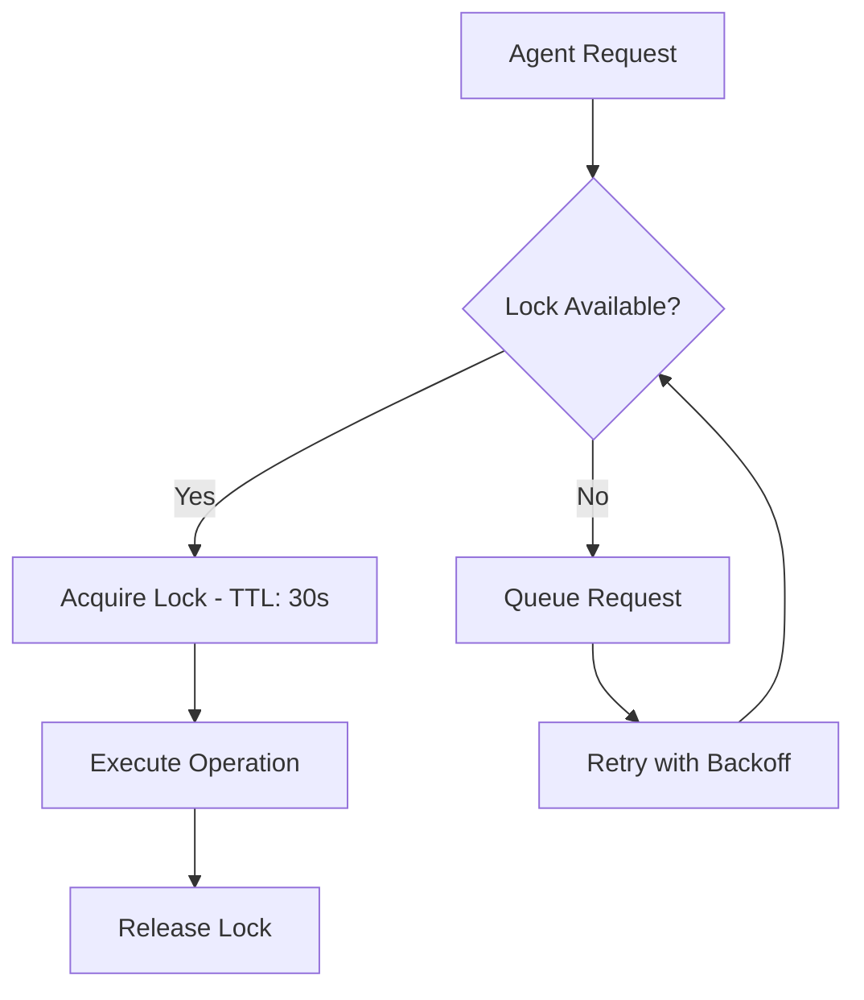
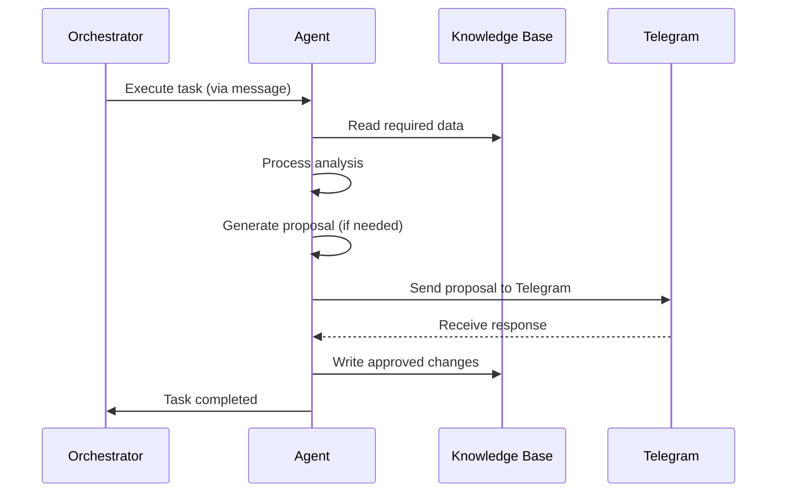

# LaunchPilot Multi-Agent Backend System Architecture

## Executive Summary

This document defines the architecture for a professional, robust, and autonomous Multi-Agent Backend System for LaunchPilot. The system consists of **15 specialized agents** that work collaboratively to manage, optimize, and grow the platform without frontend interference.

---

## 1. SYSTEM OVERVIEW

### 1.1 Agent Ecosystem

| Agent | ID | Primary Responsibility | Status |
|-------|-----|---------------------|--------|
| Data Aggregator | `AGT-DATA` | Collects, validates, and ingests new tool data | 🔄 Implementation Pending |
| Market Intelligence | `AGT-MKTG` | Competitive analysis and market trend monitoring | 🔄 Implementation Pending |
| Content Editor | `AGT-EDIT` | Automated content generation and optimization | 🔄 Implementation Pending |
| SEO Optimizer | `AGT-SEO` | Search engine optimization and meta generation | 🔄 Implementation Pending |
| Monetization | `AGT-MONET` | Revenue optimization and affiliate management | 🔄 Implementation Pending |
| Technical Sentinel | `AGT-TECH` | Code quality, performance, and security monitoring | 🔄 Implementation Pending |
| Conversion | `AGT-CONV` | Conversion rate optimization and A/B testing | 🔄 Implementation Pending |
| Growth | `AGT-GROWTH` | User engagement and retention strategies | 🔄 Implementation Pending |
| Database Cleanup | `AGT-CLEAN` | Data integrity and cleanup operations | 🔄 Implementation Pending |
| Security | `AGT-SEC` | Security audits and vulnerability management | 🔄 Implementation Pending |
| Feedback Analyst | `AGT-FEEDBACK` | User feedback processing and sentiment analysis | 🔄 Implementation Pending |
| Content Strategist | `AGT-STRAT` | Content planning and SEO strategy | 🔄 Implementation Pending |
| Language | `AGT-LANG` | Internationalization and localization | 🔄 Implementation Pending |
| System Architect | `AGT-ARCH` | System health and architectural decisions | 🔄 Implementation Pending |
| Orchestrator | `AGT-ORCH` | Central coordination and workflow management | 🔄 Implementation Pending |

---

## 2. COMMUNICATION PROTOCOL

### 2.1 Message Channel Architecture

All agents communicate through a **Message Queue System** using Redis Pub/Sub with the following channels:

```typescript
// Channel naming convention: agent.{agentId}.{messageType}
const CHANNELS = {
  // Command & Control
  COMMANDS: 'agent.orchestrator.commands',
  WORKFLOWS: 'agent.orchestrator.workflows',
  
  // Agent-to-Agent Communication
  DATA_MARKETING: 'agent.data.marketing',
  MARKETING_CONTENT: 'agent.marketing.content',
  CONTENT_EDIT_SEO: 'agent.content_edit.seo',
  SEO_MONETIZATION: 'agent.seo.monetization',
  
  // Knowledge Base Events
  KB_UPDATED: 'agent.kb.updated',
  KB_REQUEST: 'agent.kb.request',
  
  // Proposal System
  PROPOSALS: 'agent.orchestrator.proposals',
  PROPOSAL_RESPONSE: 'agent.orchestrator.proposal_responses',
  
  // Error & Status
  ERRORS: 'agent.system.errors',
  HEALTH: 'agent.system.health',
  METRICS: 'agent.system.metrics',
} as const;
```

### 2.2 Message Format

All messages follow a standardized envelope structure:

```typescript
interface AgentMessage {
  id: string;                 // UUID v4
  source: AgentId;           // Sending agent ID
  target?: AgentId;          // Target agent ID (optional for broadcast)
  type: MessageType;         // CATEGORY_UPDATE, REVIEW_REQUEST, etc.
  payload: unknown;          // Strongly-typed payload
  timestamp: string;         // ISO 8601 timestamp
  priority: 'low' | 'medium' | 'high';
  correlationId?: string;    // For request/response tracking
  ttl?: number;              // Time-to-live in seconds (default: 3600)
}

interface AgentResponse extends AgentMessage {
  target: AgentId;
  status: 'success' | 'error' | 'pending';
  error?: {
    code: string;
    message: string;
    details?: unknown;
  };
}
```

### 2.3 Conflict Resolution Protocol

To prevent race conditions and data conflicts:

1. **Lock-Based Concurrency Control**: Before modifying shared resources, agents request locks via `AGENT_LOCK_ACQUIRE` message
2. **Optimistic Concurrency**: All KB writes include version checking
3. **Sequential Workflow Execution**: Orchestrator enforces dependency chains
4. **Dead Letter Queue**: Failed messages are retried with exponential backoff



---

## 3. SHARED STATE MANAGEMENT

### 3.1 Knowledge Base Access Layer

The system implements a **Three-Layer Knowledge Base Architecture**:

```
┌─────────────────────────────────────────────────────────┐
│           AGENT ACCESS LAYER (ABSTRACTIONS)          │
│  - Type-safe interfaces                                │
│  - Validation rules                                      │
│  - Transaction boundaries                                │
└─────────────────────────────────────────────────────────┘
                        │
                        ▼
┌─────────────────────────────────────────────────────────┐
│           KNOWLEDGE BASE MANAGER (SINGLETON)           │
│  - Connection pooling                                    │
│  - Cache invalidation                                    │
│  - Atomic operations                                     │
└─────────────────────────────────────────────────────────┘
                        │
                        ▼
┌─────────────────────────────────────────────────────────┐
│           PERSISTENCE LAYER                            │
│  - PostgreSQL (Production)                               │
│  - SQLite (Development)                                  │
│  - JSON Files (Knowledge Base Import)                    │
└─────────────────────────────────────────────────────────┘
```

### 3.2 Knowledge Base Schema Extensions

Extended Prisma schema for agent state management:

```prisma
// Agent execution state tracking
model AgentTask {
  id          String   @id @default(cuid())
  agentId     String
  name        String   // Task name for identification
  status      String   @default("pending") // pending, running, completed, failed
  priority    Int      @default(0)
  
  // Input/Output
  input       String?  // JSON serialized input
  output      String?  // JSON serialized output
  
  // Timing
  startedAt   DateTime?
  completedAt DateTime?
  nextRunAt   DateTime?
  lastRunAt   DateTime?
  
  // Error handling
  error       String?  // Error message if failed
  retryCount  Int      @default(0)
  maxRetries  Int      @default(3)
  
  createdAt   DateTime @default(now())
  updatedAt   DateTime @default(now())
  
  @@index([agentId, status])
  @@index([nextRunAt])
  @@index([name])
}

// Agent proposals awaiting approval
model AgentProposal {
  id          String   @id @default(cuid())
  agentId     String   // Originating agent
  type        String   // SEO_UPDATE, CONTENT_ADD, NEW_TOOL, etc.
  action      String   // Proposed action
  payload     String   // JSON serialized proposal data
  status      String   @default("pending") // pending, approved, rejected
  priority    Int      @default(0)
  
  // Approval tracking
  approvedBy  String?
  approvedAt  DateTime?
  rejectionReason String?
  
  createdAt   DateTime @default(now())
  updatedAt   DateTime @default(now())
  
  @@index([status, priority])
  @@index([agentId])
}

// Shared state with versioning
model AgentState {
  id          String   @id @default(cuid())
  key         String   @unique // compound_id format: agentId:key
  value       String   // JSON serialized state
  version     Int      @default(1)
  lockedBy    String?  // Agent ID holding lock
  lockedAt    DateTime?
  
  createdAt   DateTime @default(now())
  updatedAt   DateTime @default(now())
}
```

### 3.3 Knowledge Base Access API

```typescript
// src/lib/agent-kb.ts
interface KnowledgeBaseClient {
  // Read operations (cached)
  read<T>(key: string): Promise<T | null>;
  readMany<T>(pattern: string): Promise<T[]>;
  
  // Write operations (transactional)
  write<T>(key: string, value: T, expectedVersion?: number): Promise<void>;
  atomic<T>(key: string, updater: (current: T | null) => T): Promise<void>;
  
  // Locking for critical sections
  acquireLock(key: string, ttlSeconds?: number): Promise<boolean>;
  releaseLock(key: string): Promise<void>;
  
  // Tool-specific operations
  getTool(slug: string): Promise<KnowledgeTool | null>;
  getCategory(slug: string): Promise<Category | null>;
  searchTools(query: ToolSearchParams): Promise<ToolSearchResult>;
}
```

---

## 4. ERROR HANDLING STRATEGY

### 4.1 Centralized Error Architecture

```
┌─────────────────────────────────────────────────────────┐
│                    ERROR FLOW                           │
└─────────────────────────────────────────────────────────┘
                        │
                        ▼
┌─────────────────────────────────────────────────────────┐
│   AGENT ERROR HANDLER (try-catch wrapper)               │
└─────────────────────────────────────────────────────────┘
                        │
                        ▼
┌─────────────────────────────────────────────────────────┐
│   ERROR LOGGING SERVICE                                 │
│   - Logs to ActivityLog table                           │
│   - Stores full context and stack trace                 │
│   - Tags for quick filtering                            │
└─────────────────────────────────────────────────────────┘
                        │
                        ▼
┌─────────────────────────────────────────────────────────┐
│   ERROR CLASSIFICATION                                  │
│   - CRITICAL: System halt required                        │
│   - RECOVERABLE: Auto-retry with backoff                │
│   - TRANSIENT: Temporary, skip and continue              │
└─────────────────────────────────────────────────────────┘
                        │
                        ▼
┌─────────────────────────────────────────────────────────┐
│   RECOVERY ACTIONS                                      │
│   - Retry with exponential backoff                        │
│   - Fallback to cached/default values                    │
│   - Alert to Telegram for manual intervention            │
│   - Escalate to Orchestrator for system-level recovery   │
└─────────────────────────────────────────────────────────┘
```

### 4.2 Error Types and Handling

```typescript
// src/lib/agent-errors.ts
enum AgentErrorType {
  VALIDATION_ERROR = 'VALIDATION_ERROR',     // Input/processing validation failed
  NETWORK_ERROR = 'NETWORK_ERROR',           // External API or network failure
  KB_ACCESS_ERROR = 'KB_ACCESS_ERROR',     // Knowledge base read/write failure
  PARSING_ERROR = 'PARSING_ERROR',         // Data parsing failure
  BUSINESS_LOGIC_ERROR = 'BUSINESS_LOGIC_ERROR', // Internal logic error
  EXTERNAL_SERVICE_ERROR = 'EXTERNAL_SERVICE_ERROR', // Third-party service error
}

interface AgentError extends Error {
  type: AgentErrorType;
  agentId: AgentId;
  context: Record<string, unknown>;
  retryable: boolean;
  fatal: boolean;
}

// Error handler with automatic recovery
class AgentErrorHandler {
  static async handle(error: AgentError): Promise<void> {
    // Log to database
    await prisma.activityLog.create({
      data: {
        action: `AGENT_ERROR_${error.type}`,
        resource: error.agentId,
        details: JSON.stringify({
          message: error.message,
          context: error.context,
          stack: error.stack,
        }),
      },
    });

    // Send to Telegram if critical
    if (error.type === AgentErrorType.CRITICAL || error.fatal) {
      await TelegramGateway.sendErrorAlert(error);
    }

    // Retry logic
    if (error.retryable) {
      await this.scheduleRetry(error);
    }
  }
}
```

---

## 5. TELEGRAM GATEWAY LOGIC

### 5.1 Configuration

```typescript
// Required environment variables
const TELEGRAM_CONFIG = {
  BOT_TOKEN: process.env.TELEGRAM_BOT_TOKEN!, // Bot API token
  CHAT_ID: process.env.TELEGRAM_ADMIN_CHAT_ID || '967779403123', // Default admin ID
  API_BASE: 'https://api.telegram.org/bot',
  PARSE_MODE: 'HTML',
  DISABLE_WEB_PAGE_PREVIEW: true,
} as const;
```

### 5.2 Proposal Message Structure

```typescript
// Proposal payload structure
interface ProposalPayload {
  id: string;           // Unique proposal ID (UUID)
  agentId: AgentId;     // Originating agent
  type: ProposalType;   // NEW_TOOL, SEO_UPDATE, CONTENT_ADD, etc.
  title: string;        // Human-readable title
  description: string;  // Detailed description
  impact: {
    category: string;   // HIGH, MEDIUM, LOW
    riskScore: number;  // 0-100
    estimatedValue?: string; // Revenue impact, traffic impact, etc.
  };
  data: unknown;        // Full proposal data (tool, content, changes)
  preview?: {           // Rich preview for Telegram
    text: string;
    imageUrl?: string;
    buttons?: ProposalButton[];
  };
  createdAt: string;
  expiresAt: string;    // Auto-expire if not responded to
}

interface ProposalResponse {
  proposalId: string;
  action: 'approve' | 'reject' | 'request_changes';
  feedback?: string;    // Optional feedback
  timestamp: string;
}
```

### 5.3 Callback System Architecture

The Telegram gateway implements inline keyboards with callback data:

```typescript
// Callback data format: prs_{proposalId}_{action}
const CALLBACK_FORMAT = {
  APPROVE: (id: string) => `prs_${id}_approve`,
  REJECT: (id: string) => `prs_${id}_reject`,
  REQUEST_CHANGES: (id: string) => `prs_${id}_changes`,
} as const;

// Webhook endpoint for processing responses
// POST /api/telegram/callback
async function handleProposalCallback(
  callbackQuery: Telegram.CallbackQuery
): Promise<void> {
  const { data, from } = callbackQuery;
  
  // Parse callback data
  const match = data?.match(/^prs_([a-f0-9-]+)_(approve|reject|changes)$/);
  if (!match) return;
  
  const [, proposalId, action] = match;
  
  // Process response
  const response: ProposalResponse = {
    proposalId,
    action: action as 'approve' | 'reject' | 'request_changes',
    timestamp: new Date().toISOString(),
  };
  
  // Emit to orchestration channel
  await redis.publish(
    CHANNELS.PROPOSAL_RESPONSE,
    JSON.stringify({
      ...response,
      actor: from?.username,
    })
  );
  
  // Acknowledge callback
  await answerCallbackQuery(callbackQuery.id);
}
```

### 5.4 Message Templates

**New Tool Proposal:**
```
🔔 NEW TOOL PROPOSAL
📊 Agent: AGT-DATA (Data Aggregator)

🔧 Tool: {toolName}
📁 Category: {category}
💰 Pricing: {pricing}
🌐 Website: {websiteUrl}

📝 Description: {description}

💡 Why this tool?
• {reason1}
• {reason2}
• {reason3}

📊 Impact Assessment
• Risk Score: {riskScore}/100
• Estimated Value: {estimatedValue}

[✅ Approve] [❌ Reject] [💬 Request Changes]
```

**SEO Optimization Proposal:**
```
🔍 SEO OPTIMIZATION PROPOSAL
📊 Agent: AGT-SEO (SEO Optimizer)

📄 Page: /tools/{toolSlug}
📈 Current Score: {currentScore}/100
🎯 Target Score: {targetScore}/100

📋 Recommended Changes:
• Title: {newTitle}
• Description: {newDescription}
• Keywords: {keywords}

[✅ Approve] [❌ Reject] [💬 Request Changes]
```

---

## 6. AGENT SPECIFICATIONS

### 6.1 Data Aggregator (AGT-DATA)

**Purpose**: Automatically discovers, validates, and ingests new AI tools into the knowledge base.

**Responsibilities**:
- Monitor external APIs and sources for new tools
- Validate tool data against schema requirements
- Deduplicate against existing knowledge base entries
- Generate SEO-friendly slugs and metadata
- Send proposals for human approval before ingestion

**Dependencies**: System Architect, Security, Language

**Configuration**:
```typescript
interface DataAggregatorConfig {
  sources: string[];           // RSS feeds, APIs to monitor
  validationThreshold: number;   // Minimum data quality score (0-100)
  autoProposeThreshold: number;  // Auto-send proposals above score
  schedule: string;              // Cron schedule (default: "0 */6 * * *")
}
```

### 6.2 Market Intelligence (AGT-MKTG)

**Purpose**: Analyzes market trends and competitive landscape.

**Responsibilities**:
- Track competitor tool additions and updates
- Monitor pricing changes and market positioning
- Identify trending categories and emerging technologies
- Generate market reports and insights

**Dependencies**: Data Aggregator, Content Strategist

### 6.3 Content Editor (AGT-EDIT)

**Purpose**: Generates and optimizes content for tools and blog posts.

**Responsibilities**:
- Generate tool descriptions and use cases
- Create blog posts from tool data
- Optimize existing content for readability
- Maintain content quality standards

**Dependencies**: Language, SEO Optimizer

### 6.4 SEO Optimizer (AGT-SEO)

**Purpose**: Ensures optimal search engine visibility.

**Responsibilities**:
- Analyze and optimize page metadata
- Generate and validate JSON-LD structured data
- Monitor search performance metrics
- Suggest internal linking opportunities

**Dependencies**: Content Editor, Knowledge Base

### 6.5 Monetization (AGT-MONET)

**Purpose**: Maximizes revenue through affiliate and advertising optimization.

**Responsibilities**:
- Optimize affiliate link placement and presentation
- A/B test pricing strategies for premium tools
- Track revenue attribution and performance
- Identify monetization opportunities

**Dependencies**: Conversion, Technical Sentinel

### 6.6 Technical Sentinel (AGT-TECH)

**Purpose**: Monitors system health and technical performance.

**Responsibilities**:
- Monitor API response times and error rates
- Track database performance and query optimization
- Validate code quality and TypeScript strict mode compliance
- Generate technical health reports

**Dependencies**: All agents (monitoring target)

### 6.7 Conversion (AGT-CONV)

**Purpose**: Optimizes conversion rates and user journey.

**Responsibilities**:
- Analyze exit intent and conversion funnels
- A/B test UI variations
- Optimize call-to-action placement
- Track and improve funnel metrics

**Dependencies**: Growth, Monetization

### 6.8 Growth (AGT-GROWTH)

**Purpose**: Drives user engagement and retention.

**Responsibilities**:
- Analyze user behavior patterns
- Generate weekly digest emails
- Track engagement metrics
- Suggest growth initiatives

**Dependencies**: Feedback Analyst, Monetization

### 6.9 Database Cleanup (AGT-CLEAN)

**Purpose**: Maintains data integrity and optimizes storage.

**Responsibilities**:
- Remove orphaned and duplicate records
- Optimize database indexes
- Archive old analytics data
- Validate referential integrity

**Dependencies**: System Architect

### 6.10 Security (AGT-SEC)

**Purpose**: Ensures platform security and compliance.

**Responsibilities**:
- Monitor for suspicious activity
- Validate authentication and authorization
- Check for known vulnerabilities
- Generate security audit reports

**Dependencies**: Technical Sentinel

### 6.11 Feedback Analyst (AGT-FEEDBACK)

**Purpose**: Processes user feedback and sentiment analysis.

**Responsibilities**:
- Analyze review sentiment and themes
- Extract feature requests from feedback
- Generate feedback summaries
- Identify UX improvement opportunities

**Dependencies**: Knowledge Base, Content Strategist

### 6.12 Content Strategist (AGT-STRAT)

**Purpose**: Plans content roadmap and SEO strategy.

**Responsibilities**:
- Generate content calendars
- Identify content gaps
- Plan category expansions
- Strategize editorial direction

**Dependencies**: Market Intelligence, Feedback Analyst

### 6.13 Language (AGT-LANG)

**Purpose**: Manages internationalization and localization.

**Responsibilities**:
- Translate content to supported languages
- Maintain translation consistency
- Detect and flag untranslated content
- Generate localization reports

**Dependencies**: All content-producing agents

### 6.14 System Architect (AGT-ARCH)

**Purpose**: Oversees system architecture and health.

**Responsibilities**:
- Monitor agent performance and health
- Coordinate system-wide workflows
- Make architectural decisions
- Track technical debt

**Dependencies**: All agents (supervisory role)

### 6.15 Orchestrator (AGT-ORCH)

**Purpose**: Central coordination hub for all agents.

**Responsibilities**:
- Schedule and trigger agent workflows
- Route messages between agents
- Manage proposal lifecycle
- Handle error escalation

**Dependencies**: System Architect

---

## 7. WORKFLOW ARCHITECTURE

### 7.1 Standard Agent Workflow



### 7.2 Scheduled Workflows

Agents run on configurable schedules:

| Agent | Schedule | Frequency |
|-------|----------|-----------|
| Data Aggregator | `0 */6 * * *` | Every 6 hours |
| Market Intelligence | `0 0 * * *` | Daily at midnight |
| Content Editor | `0 */12 * * *` | Every 12 hours |
| SEO Optimizer | `0 2 * * *` | Daily at 2 AM |
| Monetization | `*/30 * * * *` | Every 30 minutes |
| Technical Sentinel | `*/15 * * * *` | Every 15 minutes |
| Conversion | `0 */4 * * *` | Every 4 hours |
| Growth | `0 9 * * *` | Daily at 9 AM |
| Database Cleanup | `0 3 * * 0` | Sundays at 3 AM |
| Security | `*/45 * * * *` | Every 45 minutes |
| Feedback Analyst | `0 */8 * * *` | Every 8 hours |
| Content Strategist | `0 0 1 * * *` | Monthly on 1st |
| Language | `0 1 * * *` | Daily at 1 AM |
    System Architect | `*/10 * * * *` | Every 10 minutes |

---

## 8. IMPLEMENTATION REQUIREMENTS

### 8.1 File Structure

```
src/lib/agents/
├── index.ts                    # Agent registry and exports
├── orchestrator.ts             # Central orchestration logic
├── telegram-gateway.ts         # Telegram integration
├── agent-errors.ts             # Error handling
├── agent-kb.ts                 # Knowledge base client
├── types.ts                    # Shared agent types
├── data-aggregator.ts          # AGT-DATA
├── market-intelligence.ts      # AGT-MKTG
├── content-editor.ts           # AGT-EDIT
├── seo-optimizer.ts            # AGT-SEO
├── monetization.ts             # AGT-MONET
├── technical-sentinel.ts       # AGT-TECH
├── conversion.ts               # AGT-CONV
├── growth.ts                   # AGT-GROWTH
├── database-cleanup.ts         # AGT-CLEAN
├── security.ts                 # AGT-SEC
├── feedback-analyst.ts         # AGT-FEEDBACK
├── content-strategist.ts       # AGT-STRAT
├── language.ts                 # AGT-LANG
└── system-architect.ts         # AGT-ARCH

src/app/api/agents/
├── route.ts                    # Agent API endpoints
├── telegram/
│   ├── webhook/route.ts        # Telegram webhook handler
│   └── callback/route.ts       # Callback query handler
├── health/route.ts             # Health check endpoint
└── proposals/
    ├── route.ts                # Proposal API
    └── [id]/route.ts          # Individual proposal handling

tests/agents/
├── agent-core.test.ts          # Core agent functionality tests
├── telegram-gateway.test.ts    # Telegram integration tests
├── kb-client.test.ts           # Knowledge base client tests
└── data-aggregator.test.ts     # Agent-specific tests
```

### 8.2 TypeScript Strict Mode Compliance

All agent code must include:

```typescript
// tsconfig.json strict settings (already enforced)
{
  "strict": true,
  "noImplicitAny": true,
  "strictNullChecks": true,
  "strictFunctionTypes": true,
  "strictBindCallApply": true,
  "strictPropertyInitialization": true,
  "noImplicitThis": true,
  "alwaysStrict": true
}

// Agent must explicitly handle null/undefined
async function processTool(toolId: string): Promise<ProcessedTool> {
  const tool = await kb.getTool(toolId);
  if (!tool) {
    throw new AgentError({
      type: AgentErrorType.KB_ACCESS_ERROR,
      agentId: 'AGT-DATA',
      context: { toolId },
      message: `Tool not found: ${toolId}`,
      retryable: false,
      fatal: false,
    });
  }
  // ... rest of processing
}
```

---

## 9. SECURITY CONSIDERATIONS

### 9.1 Authentication & Authorization

- All agent endpoints require `X-Agent-Secret` header with valid token
- Agent tokens stored encrypted in environment variables
- Role-based access control for agent actions
- Rate limiting per agent to prevent abuse

### 9.2 Data Protection

- All KB writes are validated against Zod schemas
- Sensitive data encrypted at rest
- PII isolation and GDPR compliance
- Audit trail for all agent actions

### 9.3 Network Security

- HTTPS-only communication
- Webhook signature validation
- IP whitelist for Telegram callbacks
- Request sanitization and validation

---

## 10. MONITORING & OBSERVABILITY

### 10.1 Health Checks

```typescript
interface AgentHealth {
  agentId: AgentId;
  status: 'healthy' | 'degraded' | 'unhealthy';
  lastHeartbeat: string;
  lastCompletedTask?: {
    taskId: string;
    duration: number;
    success: boolean;
  };
  pendingProposals: number;
  errorCount: number;
  uptime: number; // seconds
}
```

### 10.2 Metrics Collection

- Task execution time and success rate
- Proposal approval/rejection rates
- Knowledge base read/write latency
- Error frequency and types

---

## 11. NEXT STEPS

After architecture approval:

1. **Phase 2**: Implement core infrastructure (Orchestrator, Telegram Gateway, KB Client)
2. **Phase 3**: Implement agents in priority order (Data Aggregator → SEO Optimizer → Growth)
3. **Phase 4**: Deploy and test with production-like data
4. **Phase 5**: Monitor, optimize, and scale

---

*Document Version: 1.0*
*Last Updated: 2026-07-14*
*Author: LaunchPilot Multi-Agent System*